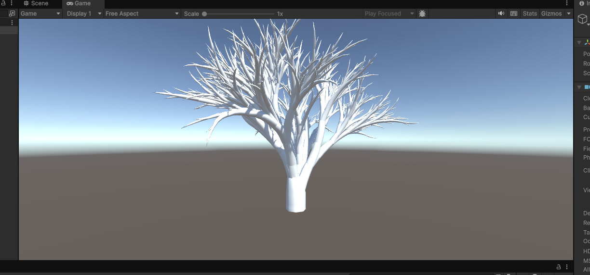
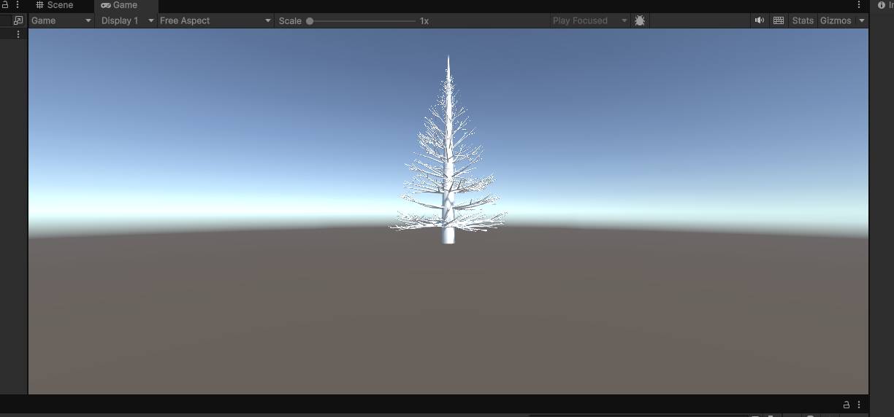

# Procedural-Gem

A procedural generation tool for creating trees using l-systems. This projects has a domain specfic language for specifing trees and an "compiler" that converts this domain specfic language to a c# file that can be used to generate the tree.

## Acer Tree Example
The domain specific langage for an acer tree is below
```
nLeaves = 15
widthD = 0.4 / 8
lengthD = 0.1

DAngle1 = rnd * 40 + 60
DAngle2 = rnd * 40 + 100
BranchAngle = rnd * 15 + 10

F:
    F l = l, leaves = 0

A:
    rand = rnd / (0.24 * Pow(l, 2.5))
    if (l == 2)
    {
        rand = rand + 0.5
    }
    if (rand < 0.4)
    {
        [
        F l = l / 2
        ! w = w
        & a = BranchAngle
        F l = l / 2, leaves = nLeaves, leafDAngle = 40, leafRAngle = 140
        A w = w - widthD, l = l - lengthD
        ]
    }
    else if (rand < 0.8)
    {
        [
        F l = l / 2
        ! w = w
        & a = BranchAngle
        / a = 90
        F l = l / 2, leaves = nLeaves, leafDAngle = 40, leafRAngle = 140
        A w = w - widthD, l = l - lengthD
        ]

        [
        ! w = w
        ^ a = BranchAngle
        \ a = 90
        F l = l / 2, leaves = nLeaves, leafDAngle = 40, leafRAngle = 140
        A w = w - widthD, l = l - lengthD
        ]
    }
    else
    {
        [
        F l = l / 2
        ! w = w
        & a = BranchAngle
        F l = l / 2, leaves = nLeaves, leafDAngle = 40, leafRAngle = 140
        A w = w - widthD, l = l - lengthD
        ]
        / a = DAngle1
        [
        ! w = w
        & a = BranchAngle
        F l = l / 2, leaves = nLeaves, leafDAngle = 40, leafRAngle = 140
        A w = w - widthD, l = l - lengthD
        ]
        / a = DAngle2
        [
        ! w = w
        & a = BranchAngle
        F l = l / 2, leaves = nLeaves, leafDAngle = 40, leafRAngle = 140
        A w = w - widthD, l = l - lengthD
        ]
    }

Axiom:
    ! w = 0.7
    F l = 0.5
    / a = 45
    A w = 0.4, l = 2
```
The generated mesh looks like this


## Pine Tree Example
The domain specific langage for an pine tree is below
```
lengthR = 0.8
widthR = 0.8
branchLengthR = 0.93
secondBranceAngle = 80
secondBranceAngleV = 30
nLeaves = 300
itterations = 15

Q:
    ! w = w
    & a = 90
    + a = rnd * 360
    ! w = bw

    bCount = (rnd * 2) + 5
    loop(bCount)
    {
        rand = rnd * 130 / bCount
        + a = rand
        [
        ^ a = 5 / Max(bl * bl, 0.05) - 30 * (rnd * 0.2 + 0.9)
        A l = bl, w = bw
        ]
        + a = 360 / bCount - rand
    }

    ! w = w
    $
    F l = l, leaves = l * nLeaves / 3, leafDAngle = 20, leafRAngle = 140
    Q w = w - 0.2 / 15, l = l * 0.95, bw = bw * widthR, bl = bl * branchLengthR
    %

A:
    ang = rnd * secondBranceAngleV + secondBranceAngle
    if (rnd < l)
    {
        ! w = w
        ^ a = rnd * 15 - 5
        F l = l, leaves = l * nLeaves / 3, leafDAngle = 40, leafRAngle = 140
        - a = ang / 2
        [
        A l = l * lengthR, w = w * widthR
        ]
        + a = ang
        [
        A l = l * lengthR, w = w * widthR
        ]
        - a = ang / 2
        A l = l * lengthR, w = w * widthR
    }
    else
    {
        ! w = w
        ^ a = rnd * 15 - 5
        F l = l, leaves = l * nLeaves / 3, leafDAngle = 40, leafRAngle = 140
        A l = l * lengthR, w = w * widthR
    }

Axiom:
    ! w = 0.2
    F l = 0.6
    Q w = 0.2, bw = 0.05, l = 0.5, bl = 0.4
```
The generated mesh looks like this

